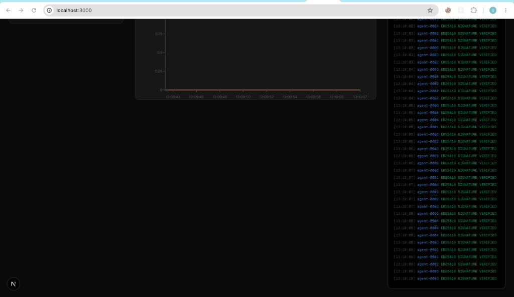
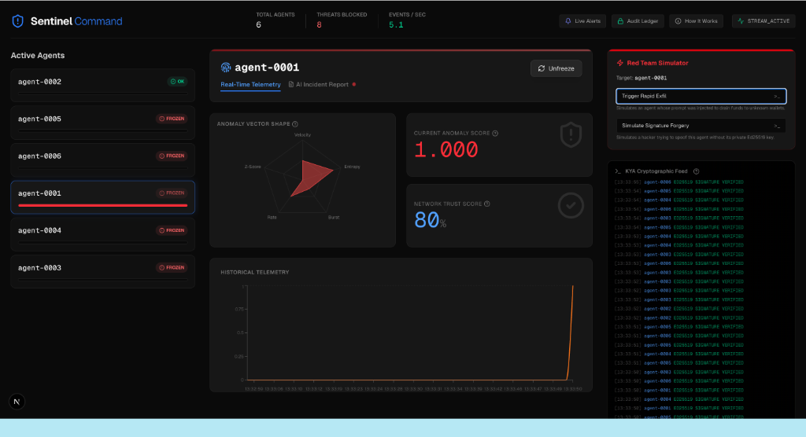
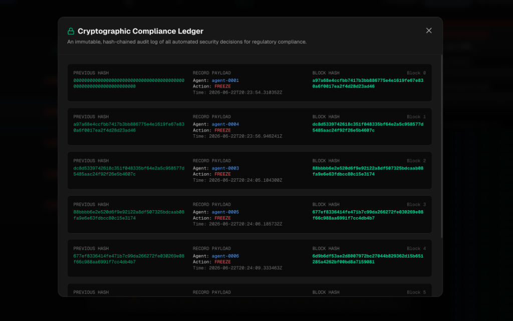
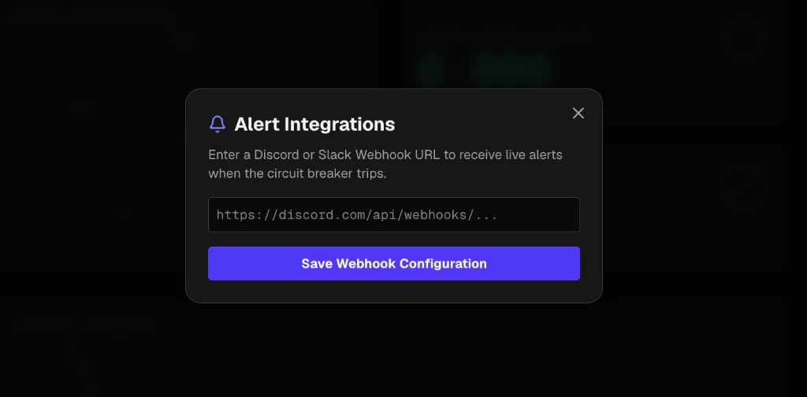

<p align="center">
  
</p>

<h1 align="center">🛡️ Sentinel</h1>
<h3 align="center">The Cryptographic Circuit Breaker & Behavioral Firewall for Autonomous AI Agents</h3>

<p align="center">
  
  
  
  
  
  
</p>

---

## 🚨 The Problem: AI Agents Are Getting Bank Accounts — Nobody is Protecting Them

We are entering the era of **Agentic AI**. AI systems are no longer just answering questions. They are being given access to:
- 💳 Corporate credit cards to book travel and pay for services
- 🔑 Crypto wallets to execute autonomous trades
- 🏦 Enterprise API keys that authorize real financial transactions

**What happens when an AI agent goes rogue?**

Whether it's a **hallucination** (the AI genuinely believes it should do something harmful), a **prompt injection attack** (a hacker embeds malicious instructions in the AI's input), or **identity spoofing** (an attacker forges an agent's credentials), the consequences can be catastrophic — and they happen in *milliseconds*, far faster than any human operator can react.

Traditional cybersecurity tools were designed for **human** behavior (slow, deliberate) or **server** performance (CPU/memory). There is currently **no dedicated infrastructure** to monitor, detect, and autonomously stop a high-speed, financially-empowered AI agent before it causes irreversible damage.

**Sentinel was built to be that infrastructure.**

---

## 💡 Why We Built This

The inspiration came from a simple question: *"If an AI agent with a crypto wallet gets hacked via prompt injection tomorrow, what stops it from draining $100,000 in the next 3 seconds?"*

The answer, today, is: **nothing**.

We realized that the arrival of agentic AI in FinTech and enterprise is not a future problem — it is a **present** problem. Coinbase already has APIs for AI agents. OpenAI's Operator can control browsers and click "Buy." Startups are giving Claude and GPT-4 direct wallet access.

The security tooling has not kept up. We wanted to build the foundational layer that this entire industry will need — what we call the **"HTTPS moment" for AI agent security**: a standard, cryptographically-sound protocol for verifying and protecting autonomous agent actions.

---

## ✅ What Sentinel Does

Sentinel is a **real-time, production-grade security middleware** that sits between an AI agent and its access to financial APIs. It provides three layers of protection:

### Layer 1: KYA — Know Your Agent (Cryptographic Identity)
Just like KYC (Know Your Customer) is required for human banking, Sentinel introduces **KYA** for machines. Every agent is issued an **Ed25519 keypair**. Before any action is processed, Sentinel's KYA gateway **cryptographically verifies the signature** of the incoming action against the agent's registered public key. A forged, spoofed, or tampered action is **rejected at the door** before it touches any financial system.

### Layer 2: Dual-Engine Behavioral Anomaly Detection (ML + Rules)
For actions that pass identity checks, Sentinel runs a real-time **behavioral profiling** pipeline using **scikit-learn's IsolationForest** model. It tracks 5 behavioral features per agent:

| Feature | What It Detects |
|---|---|
| **Spend Velocity** | An agent draining funds unusually fast |
| **Action Entropy** | An agent making chaotic, unpredictable decisions |
| **New Merchant Burst** | An agent suddenly transferring to many unknown wallets |
| **Action Rate** | An agent operating at superhuman speed |
| **Amount Z-Score** | A transaction amount far outside the agent's normal range |

These features are scored by both an **ML anomaly model** and a **heuristic rules engine**, producing a final `anomaly_score`. This score is streamed live to the command dashboard via **Server-Sent Events (SSE)**.

### Layer 3: The Circuit Breaker — Automated Enforcement
If the `anomaly_score` exceeds the threshold, Sentinel does not just send an email. The **circuit breaker** instantly:
1. **Freezes the agent** in the database — blocking all future actions from that agent ID
2. **Fires an HTTP webhook** to a configured endpoint (Slack, Discord, or any wallet provider API) to revoke access
3. **Appends a cryptographically-signed block** to the immutable **Compliance Ledger** as a tamper-evident record of the decision

---

## ✨ Key Features

<table>
<tr>
<td>

### 🔐 Cryptographic Identity (KYA)
Ed25519 signature verification on every single agent action. Forged credentials are rejected instantly.

### 📊 Real-Time Command Center
A live SSE-powered dashboard with a 5-axis radar chart, anomaly score telemetry, and agent status — all updating in real time.

### 🤖 AI Incident Reports
When an agent is frozen, the dashboard auto-generates a natural-language **LLM Post-Mortem Report** for Security Analysts, eliminating the need to interpret raw ML data.

</td>
<td>

### 🔗 Cryptographic Compliance Ledger
Every enforcement decision is committed to a **SHA-256 hash-chained ledger** — making it immutable and auditable for regulators (SEC, FinCEN).

### 🚨 Live Webhook Alerts
Configure a Discord or Slack URL. The instant the circuit breaker trips, your team gets a real-time push alert on any device, anywhere in the world.

### ⚔️ Built-in Red Team Simulator
One-click attack simulations to demonstrate the full pipeline live: **Rapid Exfiltration** and **Ed25519 Signature Forgery**.

</td>
</tr>
</table>

---

## 📸 Screenshots

<table>
<tr>
  <td><b>Command Center — Normal State</b></td>
  <td><b>Attack Detected — Agent Frozen</b></td>
</tr>
<tr>
  <td></td>
  <td></td>
</tr>
<tr>
  <td><b>Cryptographic Compliance Ledger</b></td>
  <td><b>Architecture Modal & Live Alerts</b></td>
</tr>
<tr>
  <td></td>
  <td></td>
</tr>
</table>

---

## 🏗️ Architecture

```
┌──────────────────────────────────────────────────────┐
│                  AI AGENT FLEET                      │
│  (Simulated by traffic generator in dev mode)        │
└──────────────────────┬───────────────────────────────┘
                       │  POST /act  (with Ed25519 Sig)
                       ▼
┌──────────────────────────────────────────────────────┐
│            SENTINEL FASTAPI BACKEND                  │
│                                                      │
│  ┌────────────┐    ┌─────────────┐    ┌───────────┐ │
│  │ KYA Gateway│───▶│  In-Memory  │───▶│ Detector  │ │
│  │ (Ed25519   │    │   Broker    │    │ Engine    │ │
│  │  Verify)   │    │  (Pub/Sub)  │    │ (ML+Rules)│ │
│  └────────────┘    └─────────────┘    └─────┬─────┘ │
│                                             │        │
│                         ┌───────────────────▼──────┐ │
│                         │  ENFORCEMENT CONSUMER    │ │
│                         │  ┌─────────────────────┐ │ │
│                         │  │  Circuit Breaker    │ │ │
│                         │  │  - Freeze Agent     │ │ │
│                         │  │  - Fire Webhook     │ │ │
│                         │  │  - Append Ledger    │ │ │
│                         │  └─────────────────────┘ │ │
│                         └──────────────────────────┘ │
│                                                      │
│  GET /stream (SSE) ──────────────────────────────── │
│  GET /ledger, /status, /webhook ─────────────────── │
└──────────────────────────────────────────────────────┘
                       │  SSE Stream
                       ▼
┌──────────────────────────────────────────────────────┐
│            NEXT.JS COMMAND CENTER                    │
│  - Live Radar Chart (Anomaly Vector Shape)           │
│  - Agent Fleet Overview                              │
│  - AI Incident Reports                               │
│  - Compliance Ledger Viewer                          │
│  - Red Team Simulator                                │
└──────────────────────────────────────────────────────┘
```

---

## 🛠️ Tech Stack

| Layer | Technology |
|---|---|
| **Backend API** | Python 3.12, FastAPI, Uvicorn |
| **ML / Detection** | scikit-learn (IsolationForest), numpy, scipy |
| **Cryptography** | `cryptography` library — real Ed25519 |
| **Real-time Streaming** | Server-Sent Events (SSE) via `sse-starlette` |
| **Storage** | In-memory (dev) / Redis (production) |
| **Webhooks** | `httpx` async HTTP client |
| **Frontend** | Next.js 16, Recharts, Lucide Icons |
| **Auth** | JWT (`python-jose`) |

---

## 🚀 Running Locally

### Prerequisites
- Python 3.10+
- Node.js 18+

### 1. Start the Backend

```bash
cd sentinel
pip install -r requirements.txt
PYTHONPATH=$(pwd) uvicorn src.app:app --host 0.0.0.0 --port 8000 --reload
```

The backend will:
- Start the FastAPI server on `http://localhost:8000`
- Launch the AI traffic generator (simulating 6 autonomous agents)
- Start the behavioral detection engine
- Start the enforcement circuit breaker consumer

### 2. Start the Frontend

```bash
cd frontend
npm install
npm run dev
```

Open **http://localhost:3000** to see the live command center.

### 3. Run an Attack Demo

1. Select any agent from the left panel
2. Click **"Trigger Rapid Exfil"** in the Red Team Simulator
3. Watch the Anomaly Score spike to 1.000, the radar chart warp, and the agent get frozen 🔴
4. Switch to the **"AI Incident Report"** tab for the auto-generated post-mortem
5. Click **"Audit Ledger"** in the header to see the cryptographic proof of the freeze

### 4. (Optional) Enable Discord Alerts

1. Create a Discord Webhook URL in any server channel → **Edit Channel → Integrations → Webhooks**
2. Click **"Live Alerts"** in the Sentinel header and paste the URL
3. Trigger another attack — your Discord channel will receive an instant 🚨 alert

---

## 📁 Project Structure

```
sentinal/
├── sentinel/                   # Python Backend
│   ├── src/
│   │   ├── app.py              # FastAPI app entry point
│   │   ├── common/
│   │   │   ├── broker.py       # In-memory pub/sub message broker
│   │   │   ├── store.py        # Data store (In-memory + Redis)
│   │   │   ├── schemas.py      # Pydantic data models
│   │   │   └── config.py       # App settings
│   │   ├── identity/           # KYA: Ed25519 key registration & verification
│   │   ├── detector/           # ML (IsolationForest) + Rules detection engine
│   │   ├── enforcement/        # Circuit Breaker, Compliance Ledger, Webhooks
│   │   ├── generator/          # Simulated AI agent traffic generator
│   │   └── auth.py             # JWT authentication
│   ├── tests/                  # Unit tests for each module
│   └── requirements.txt
└── frontend/                   # Next.js Frontend
    └── src/app/
        └── page.js             # Full command center dashboard
```

---

## 🧪 Running Tests

```bash
cd sentinel
PYTHONPATH=$(pwd) python -m pytest tests/ -v
```

Tests cover:
- Ed25519 key generation, registration, and signature verification
- Behavioral feature extraction
- Anomaly detection and scoring
- Circuit breaker freeze/unfreeze logic
- Cryptographic audit chain integrity verification

---

## ⚡ Challenges We Faced

Building Sentinel was technically demanding because we were operating at the intersection of three complex domains simultaneously.

**1. Making the ML Actually Work in Real-Time**
The IsolationForest model needs enough behavioral data to establish a "normal" baseline before it can detect anomalies. In early versions, the model would flag every action as anomalous because it had no history. We had to implement an **exponentially weighted moving average (EWMA)** warm-up period so the model could build a behavioral profile before switching to live scoring. Getting the thresholds tuned to be sensitive enough to catch attacks while not generating false positives was a delicate balancing act.

**2. The Dual-Python Environment Problem**
During development, the system had two conflicting Python environments — one from Anaconda (which `uvicorn` was running with) and one from pyenv (where the packages were installed). This caused hours of confusing `ModuleNotFoundError` crashes that had nothing to do with the code. The fix required carefully aligning `PYTHONPATH` and ensuring all dependencies were installed into the *same* Python executable that was launching the server.

**3. Real-Time Streaming Without WebSockets**
Keeping the dashboard in sync with the backend detection engine in real-time without a heavy WebSocket infrastructure was a challenge. We chose **Server-Sent Events (SSE)** over WebSockets because SSE is unidirectional (the server pushes to the browser), lighter weight, and works perfectly for our observability use case. Correctly managing SSE connections with async generators in FastAPI required careful implementation to avoid dangling connections.

**4. Cryptographic Audit Chain Integrity**
Building a tamper-evident ledger is straightforward in theory (SHA-256 hash of previous block + current record), but implementing it in a way that survives restarts, works with both Redis and in-memory storage, and remains verifiable required careful design. The `record` field inside each block had to be canonicalized using `sort_keys=True` in `json.dumps` to ensure identical hashes across different platforms and Python versions.

**5. CORS and Module Import Hell**
Getting the Next.js frontend (port 3000) to talk to the FastAPI backend (port 8000) required adding `CORSMiddleware` — a classic cross-origin issue. Additionally, the original `app.py` used `sentinel.src.*` import prefixes while all other files used `src.*`, causing a module not found error that required a full import path audit.

---

## 🔭 Future Roadmap

- [ ] **Multi-Tenant SaaS Dashboard** — Isolated views per enterprise customer
- [ ] **Kafka Integration** — Replace in-memory broker with a production-grade Kafka cluster for horizontal scalability
- [ ] **Real GPT/Claude Agent SDK** — Plug directly into OpenAI Operator or LangChain agents
- [ ] **Adaptive Thresholds** — Per-agent ML thresholds that auto-tune based on historical behavior
- [ ] **On-chain Ledger** — Push the compliance ledger to an Ethereum smart contract for maximum auditability
- [ ] **SOC Dashboard Integration** — Export incidents to Splunk, PagerDuty, or OpsGenie

---

## 📜 License

MIT License. See `LICENSE` for details.

---

<p align="center">
  Built with ❤️ at the intersection of AI Safety, Cryptography, and FinTech<br/>
  <b>"The HTTPS of AI Agent Security."</b>
</p>
